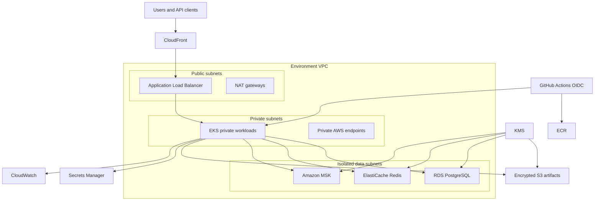

# AWS Cloud Infrastructure

Every environment has separate state, network ranges, data services, Kubernetes cluster, edge resources, logs, and budgets. Production uses three availability zones and one NAT gateway per zone; lower environments use cost-reduced profiles.
